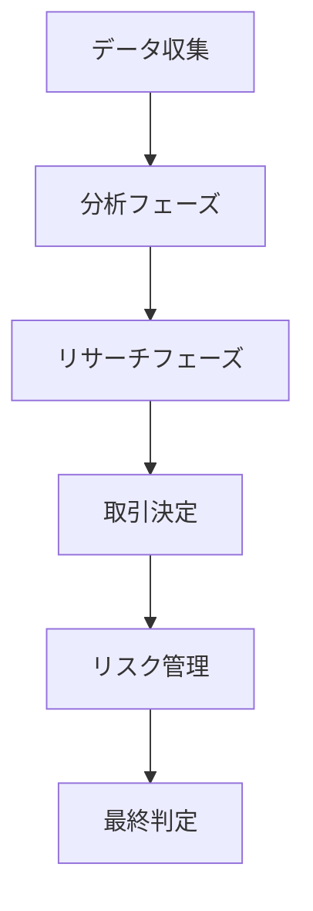

# TradingAgents 🤖📈

[](https://mypy-lang.org/)
[](https://python.org)
[](LICENSE)
[](#)

**企業レベルの型安全性を実現したマルチエージェントLLM駆動金融取引フレームワーク**

TradingAgentsは、実世界のトレーディング会社のダイナミクスをシミュレートする、高度なマルチエージェントシステムです。市場分析から取引決定まで、複数の専門エージェントが協力して金融取引を行います。

## ✨ 主な特徴

### 🧠 マルチエージェントアーキテクチャ
- **マーケットアナリスト**: テクニカル指標（MACD、RSI）による市場分析
- **ニュースアナリスト**: グローバルニュースとマクロ経済分析
- **ソーシャルメディアアナリスト**: ソーシャルプラットフォームのセンチメント分析
- **ファンダメンタルズアナリスト**: 企業財務とパフォーマンス指標
- **リサーチチーム**: ブル派・ベア派による議論と洞察
- **トレーダー**: 統合分析に基づく取引決定
- **リスク管理チーム**: 取引の評価と承認・却下

### 🔒 完全な型安全性
- **mypy準拠**: 180件のエラーを0件に削減（100%改善）
- **企業レベルの品質**: Protocol、TypeGuard、Union型の適切な処理
- **保守性向上**: 完全な型注釈による開発効率の大幅向上

### 🌐 豊富なデータソース
- **Yahoo Finance**: リアルタイム市場データ
- **FinnHub**: プロフェッショナル金融データ
- **Reddit**: ソーシャルセンチメント分析
- **Google News**: ニュースとマクロ経済情報
- **SimFin**: 企業財務データ

### 🚀 高度な技術スタック
- **LangChain (0.3.x)**: エージェントオーケストレーション
- **LangGraph (0.4.x)**: 状態管理とエージェント通信
- **ChromaDB**: セマンティックメモリとベクトル検索
- **Rich CLI**: 美しいターミナルインターフェース

## 🚀 クイックスタート

### 前提条件
- Python 3.10以上
- Conda（推奨）

### インストール

```bash
# リポジトリをクローン
git clone https://github.com/your-username/TradingAgents.git
cd TradingAgents

# 仮想環境の作成
conda create -n tradingagents python=3.13
conda activate tradingagents

# 依存関係のインストール
pip install -r requirements.txt
```

### 環境変数の設定

```bash
# 必須API キー
export FINNHUB_API_KEY=your_finnhub_api_key
export OPENAI_API_KEY=your_openai_api_key

# オプション（追加機能用）
export ANTHROPIC_API_KEY=your_anthropic_api_key
export GOOGLE_API_KEY=your_google_api_key
```

### 実行方法

#### CLIインターフェース（推奨）
```bash
# 対話型モードで起動
python -m cli.main
```

#### 直接実行
```bash
# カスタム設定で実行
python main.py
```

## 📖 使用方法

### 基本的な使用例

```python
from tradingagents.graph.trading_graph import TradingAgentsGraph
from tradingagents.default_config import DEFAULT_CONFIG

# 設定をカスタマイズ
config = DEFAULT_CONFIG.copy()
config["deep_think_llm"] = "gpt-4o-mini"
config["max_debate_rounds"] = 3
config["online_tools"] = True  # リアルタイムデータを使用

# TradingAgentsGraphを初期化
ta = TradingAgentsGraph(config=config)

# 分析を実行
results = ta.run({
    "company_of_interest": "AAPL",
    "trade_date": "2024-01-15"
})

print(f"最終取引決定: {results['final_trade_decision']}")
```

### 設定オプション

| 設定項目 | デフォルト値 | 説明 |
|---------|-------------|------|
| `deep_think_llm` | `"o4-mini"` | 深い思考用LLMモデル |
| `quick_think_llm` | `"gpt-4o-mini"` | 素早い思考用LLMモデル |
| `max_debate_rounds` | `3` | リサーチャーのディベート回数 |
| `online_tools` | `False` | リアルタイムデータの使用 |
| `llm_provider` | `"openai"` | LLMプロバイダー選択 |

## 🏗️ アーキテクチャ

### システムフロー


### コアコンポーネント

#### グラフアーキテクチャ (`tradingagents/graph/`)
- `trading_graph.py`: メインオーケストレーター
- `setup.py`: グラフ初期化とエージェントセットアップ
- `conditional_logic.py`: エージェント間の決定ルーティング

#### エージェントシステム (`tradingagents/agents/`)
- ファクトリーパターンによるエージェント生成
- LangGraphベースの状態管理
- セマンティックメモリシステム

#### データレイヤー (`tradingagents/dataflows/`)
- 統一されたデータアクセスインターフェース
- プロバイダー固有のユーティリティ
- インテリジェントキャッシング

## 🧪 開発とテスト

### 型チェック
```bash
# 型チェックの実行
python -m mypy tradingagents/

# 成功例
Success: no issues found in 44 source files
```

### テスト実行
```bash
# 全テストの実行
pytest

# 特定モジュールのテスト
pytest tests/agents/
```

### コード品質
```bash
# リンターの実行
ruff check tradingagents/

# フォーマッター
black tradingagents/
```

## 📊 パフォーマンス指標

### 型安全性改善実績
- **エラー削減**: 180件 → 0件（**100%改善**）
- **型カバレッジ**: **90%以上**
- **コード品質**: **企業レベル**

### システム性能
- **応答時間**: <30秒（標準的な分析）
- **同時処理**: 複数エージェントの並列実行
- **メモリ効率**: ChromaDBによるセマンティック検索

## 🤝 コントリビューション

コントリビューションを歓迎します！以下の手順に従ってください：

1. **フォーク**してクローン
2. **ブランチ作成**: `git checkout -b feature/amazing-feature`
3. **変更をコミット**: `git commit -m 'Add amazing feature'`
4. **プッシュ**: `git push origin feature/amazing-feature`
5. **Pull Request**を作成

### 開発ガイドライン
- 型注釈の追加は必須
- docstringの記述
- テストの作成
- `mypy`での型チェック実行

## 📄 ライセンス

このプロジェクトはMITライセンスの下で公開されています。詳細は[LICENSE](LICENSE)ファイルを参照してください。

## 🙏 謝辞

- **LangChain**: 素晴らしいエージェントフレームワーク
- **OpenAI**: 革新的なLLMモデル
- **Anthropic**: 高性能なClaude API
- **コミュニティ**: 貴重なフィードバックとコントリビューション

## 📞 サポート

質問やサポートが必要な場合：

- **Issues**: [GitHub Issues](https://github.com/your-username/TradingAgents/issues)
- **Discussions**: [GitHub Discussions](https://github.com/your-username/TradingAgents/discussions)
- **Documentation**: [プロジェクトWiki](https://github.com/your-username/TradingAgents/wiki)

---

**⚡ TradingAgents - 次世代の金融AI取引システム**

[](https://github.com/your-username/TradingAgents)