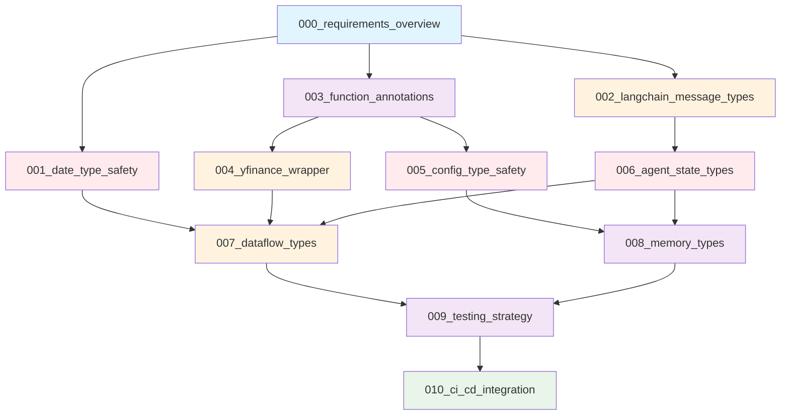

# TradingAgents 型安全性改修プロジェクト

## プロジェクト概要

TradingAgentsプロジェクトの型安全性を全面的に改修し、180件の型エラーを解決するための包括的な改修計画です。

## 改修対象

- **総エラー数**: 180件
- **主要エラータイプ**: union-attr (44件), attr-defined (24件), assignment (22件)
- **影響範囲**: dataflows, agents, graph, cli の全モジュール

## チケット一覧と依存関係

### 優先度別分類

#### Critical (即座に実行必要)
- **001_date_type_safety** - 日付処理の型安全性 (32件のエラー)
- **005_config_type_safety** - 設定の型安全性 (システム中核)
- **006_agent_state_types** - エージェント状態の型定義 (循環参照解決)

#### High (重要度高)
- **002_langchain_message_types** - LangChainメッセージ型 (44件のエラー)
- **004_yfinance_wrapper** - YFinanceラッパー (21件のエラー)
- **007_dataflow_types** - データフローの型安全性 (16件のエラー)

#### Medium (中程度の優先度)
- **003_function_annotations** - 関数の型注釈標準化
- **008_memory_types** - メモリシステムの型定義
- **009_testing_strategy** - 型チェックテスト戦略

#### Low (後回し可能)
- **010_ci_cd_integration** - CI/CD統合計画

## 実装フェーズ

### Phase 1: Critical Issues Resolution (3-5日)
1. **日付処理の型安全性** (3日)
2. **設定の型安全性** (4日)  
3. **エージェント状態の型定義** (4日)

### Phase 2: High Priority Features (7-9日)
1. **LangChainメッセージ型** (4日)
2. **YFinanceラッパー** (4日)
3. **データフローの型安全性** (5日)

### Phase 3: Foundation & Standards (6-8日)  
1. **関数の型注釈標準化** (4日)
2. **メモリシステムの型定義** (3日)
3. **型チェックテスト戦略** (6日)

### Phase 4: Automation & CI/CD (4日)
1. **CI/CD統合計画** (4日)

**総実装期間: 20-26日**

## 並行実装可能なチケット

以下のチケット群は依存関係が少なく、並行して実装可能です:

### グループA (並行実装可能)
- 001_date_type_safety
- 002_langchain_message_types  
- 003_function_annotations

### グループB (グループA完了後)
- 004_yfinance_wrapper
- 005_config_type_safety
- 006_agent_state_types

### グループC (グループB完了後)
- 007_dataflow_types
- 008_memory_types

### グループD (全完了後)
- 009_testing_strategy
- 010_ci_cd_integration

## 各チケットの詳細

| チケット | エラー件数 | 優先度 | 工数 | 主な対象ファイル |
|----------|------------|--------|------|------------------|
| [001_date_type_safety](001_date_type_safety.md) | 32 | Critical | 3日 | interface.py, yfin_utils.py |
| [002_langchain_message_types](002_langchain_message_types.md) | 44 | High | 4日 | conditional_logic.py |
| [003_function_annotations](003_function_annotations.md) | 35 | Medium | 4日 | 全モジュール |
| [004_yfinance_wrapper](004_yfinance_wrapper.md) | 21 | High | 4日 | yfin_utils.py |
| [005_config_type_safety](005_config_type_safety.md) | 14 | Critical | 4日 | config.py, trading_graph.py |
| [006_agent_state_types](006_agent_state_types.md) | 7 | Critical | 4日 | agent_states.py |
| [007_dataflow_types](007_dataflow_types.md) | 16 | High | 5日 | interface.py, utils.py |
| [008_memory_types](008_memory_types.md) | 1 | Medium | 3日 | memory.py |
| [009_testing_strategy](009_testing_strategy.md) | - | Medium | 6日 | 新規テストファイル |
| [010_ci_cd_integration](010_ci_cd_integration.md) | - | Low | 4日 | GitHub Actions |

## リスク管理

### 高リスク項目
1. **エージェント動作の変更リスク**
   - 対策: 段階的実装とテスト強化
   - 責任者: 各チケット担当者

2. **既存API互換性の破綻**
   - 対策: 後方互換性の維持とマイグレーションツール
   - 責任者: アーキテクチャ担当

3. **パフォーマンスの劣化**
   - 対策: ベンチマークテストと最適化
   - 責任者: パフォーマンス担当

### 中リスク項目
1. **外部ライブラリの互換性問題**
   - 対策: バージョン固定とテスト環境整備

2. **開発フローの混乱**
   - 対策: 段階的導入と教育プログラム

## 成功指標

### 量的指標
- [ ] 型エラー数: 180件 → 0件
- [ ] 型カバレッジ: 現在不明 → 95%以上
- [ ] CI/CDでのビルド失敗: 型チェックエラー0件
- [ ] 実装期間: 26日以内

### 質的指標
- [ ] IDEでの型ヒント完全動作
- [ ] 開発者の型エラー遭遇頻度削減
- [ ] コードレビュー効率の向上
- [ ] 新規機能開発の加速

## 実装開始前チェックリスト

- [ ] 開発環境の準備 (Python 3.13, mypy, pytest)
- [ ] バックアップとブランチ戦略の確認
- [ ] テスト環境の準備
- [ ] 依存関係の確認とアップデート
- [ ] チーム内での役割分担の決定

## 各チケット実装時の共通手順

1. **事前準備**
   - [ ] 対象ファイルのバックアップ
   - [ ] 現在のテスト実行とベースライン確立
   - [ ] 型エラーの詳細分析

2. **実装**
   - [ ] 型定義の作成・修正
   - [ ] コードの修正
   - [ ] ユニットテストの更新・追加

3. **検証**
   - [ ] mypyでの型チェック通過確認
   - [ ] 既存テストの実行
   - [ ] 新規テストの実行
   - [ ] パフォーマンステスト

4. **完了**
   - [ ] コードレビューの実施
   - [ ] ドキュメントの更新
   - [ ] チケットのクローズ

## サポートとコミュニケーション

- **技術的質問**: GitHub Issues で管理
- **実装支援**: ペアプログラミング・コードレビュー
- **進捗報告**: 週次ミーティングで共有
- **ドキュメント**: 本フォルダ内で管理

## 関連リソース

- [Python Type Hints Documentation](https://docs.python.org/3/library/typing.html)
- [mypy Documentation](https://mypy.readthedocs.io/)
- [LangChain Type Definitions](https://python.langchain.com/)
- [pandas Type Annotations](https://pandas.pydata.org/docs/development/contributing_codebase.html#type-hints)

---

**最終更新**: 2025-08-13  
**プロジェクト責任者**: 開発チーム  
**レビュー担当**: アーキテクチャチーム